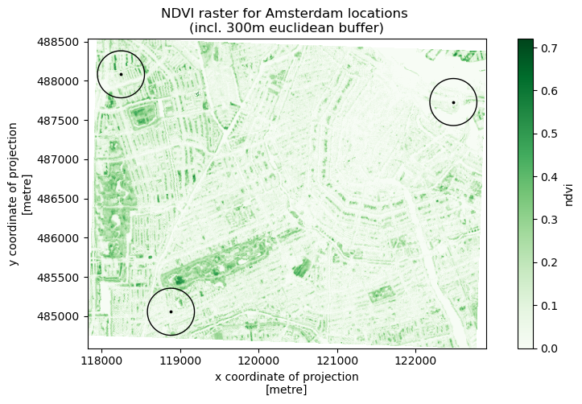

# GreenEx_Py

# Table of Contents

- [Installation](#Installation)
- [Functionalities](#Functionalities)
    - [Availability](#Availability)
        - [Mean NDVI](#get_mean_NDVI)
        - [Percentages for land cover classes](#get_landcover_percentages)
        - [Percentage of canopy coverage](#get_canopy_percentage)
        - [Percentage of park area coverage](#get_park_percentage)
    - [Accessibility](#Accessibility)
        - [Shortest distance to park](#get_shortest_distance_park)
    - [Visibility](#Visibility)
        - [Streetview GVI](#get_streetview_GVI)
        - [Viewshed GVI](#get_viewshed_GVI)
- [Sources](#Sources)

# Installation

# Functionalities
This python module models greenspace exposure from three perspectives; availability, accessibility and visibility.

- Availability refers to the presence and quantity of greenspaces within a particular region.
- Accessibility in this case relates to the proximity of greenspaces. 
- Visibility refers to the extent to which greenspaces are visible from particular locations. 

The functions which were created to model the greenspace exposure as defined by these three perspectives will be further explained below by providing examples using the following data;

```python
import geopandas as gpd

# Path to data
path = "C:/Users/ygrin/Documents/Studie - MSc ADS/Utrecht University/Block 4 - Thesis/TestData/"
example_data = gpd.read_file(path + "Test_multiple_home_locations.gpkg")

# Resulting geodataframe with example data looks as follows
	id	geometry
0	1	POINT (388644.249 392861.634)
1	2	POINT (385981.911 393805.494)
2	3	POINT (388631.230 395322.181)
```
## *Availability*
Greenspace availability is measured by four functions; [get_mean_NDVI](#get_mean_NDVI), [get_landcover_percentages](#get_landcover_percentages), [get_canopy_percentage](#get_canopy_percentage) and [get_park_percentage](#get_park_percentage). 
<br><br>
All functions will return a geodataframe that contains the original points/polygons of interest (PoI), as provided by the user, and the resulting values of the function involved. These values are based on an area of interest (AoI) which can be composed in three distinct ways;

- AoI(s) provided by user (i.e. polygon geometries) and without applying a buffer zone
- AoI(s) created by defining Euclidian buffer
- AoI(s) created by defining Network buffer

To illustrate the differences between the latter two, the following figure was generated in which: 
<br> 1. The provided point location is shown in black
<br> 2. The euclidian buffer (500 meters) is shown in red
<br> 3. The network buffer (10-min walking distance) is shown in blue
<br> 4. The street network is shown in gray


The four availability functions are briefly described hereunder. As mentioned before, for a more detailed overview of the function arguments, requirements and output, please look into the documentation section of the module.

### **get_mean_NDVI**
This function calculates the mean Normalized Difference Vegetation Index (NDVI) within an area of interest that is defined for/by the PoIs provided by the user. The PoIs should be provided in a geopackage (.gpkg) format, ideally with a projected Coordinate Reference System (CRS).

Additionally, users may provide a raster file with NDVI values. If not provided, sentinel-2-l2a data from [Planetary Computer](https://planetarycomputer.microsoft.com/) will be used to compute the NDVI raster. The NDVI raster which was created for the three locations of the example data is included in the following figure;



Now, the mean NDVI for the designated areas can be calculated by applying the following code;

```python
availability.get_mean_NDVI(point_of_interest_file=test_path+"Test_multiple_home_locations.gpkg",
                           buffer_type="euclidian",
                           buffer_dist=500,
                           write_to_file=False,
                           save_ndvi=False)

# Information provided while function was running
Retrieving NDVI raster through planetary computer...
Information on the satellite image retrieved from planetary computer, use to calculate NDVI values:              
   Date on which image was generated: 2023-04-04T22:36:14.894809Z              
   Percentage of cloud cover: 8.471548              
   Percentage of pixels with missing data 0.000123
Done, running time: 0:00:08.906117 

Calculating mean NDVI values...
Done, running time: 0:00:00.256659

# Function output
	id	geometry	                    mean_NDVI
0	1	POINT (388644.249 392861.634)	0.260
1	2	POINT (385981.911 393805.494)	0.218
2	3	POINT (388631.230 395322.181)	0.283
```
### **get_landcover_percentages**


### **get_canopy_percentage**
### **get_park_percentage**

## *Accessibility*

### **get_shortest_distance_park**

## *Visibility*

### **get_streetview_GVI**

### **get_viewshed_GVI**

## Sources
- Retrieving road network: [OpenStreetMap](https://osmnx.readthedocs.io/en/stable/)
- Retrieving satellite images for NDVI and landcover calculations: [Planetary Computer](https://planetarycomputer.microsoft.com/)
- Calculating GVI based on viewshed analysis: [Jonny Huck & Labib Labib](https://github.com/jonnyhuck/green-visibility-index/tree/master)
- Calculating GVI based on streetview images: [Ilse A. Vázquez Sánchez](https://github.com/Spatial-Data-Science-and-GEO-AI-Lab/StreetView-NatureVisibility)
- Computing sample road locations from network: [Ondrej Mlynarcik](https://github.com/Spatial-Data-Science-and-GEO-AI-Lab/2.5D-GreenViewIndex-Netherlands/blob/main/sample_points_linestrings.ipynb)
- Creation of network buffer isochrones: [Geoff Boeing](https://github.com/gboeing/osmnx-examples/blob/main/notebooks/13-isolines-isochrones.ipynb)
