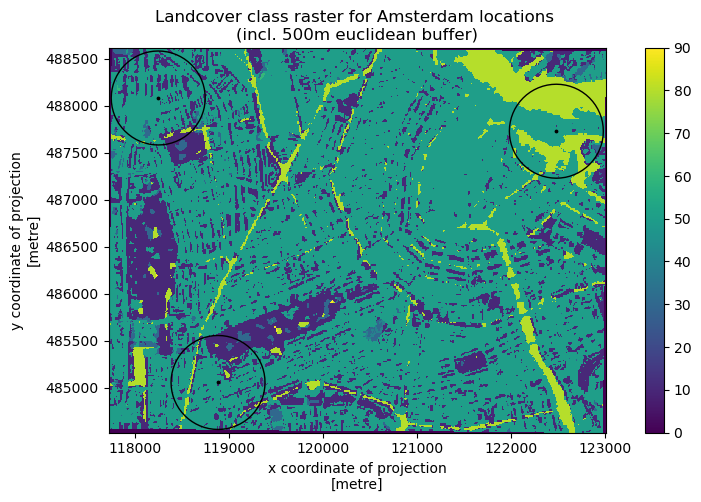

# GreenEx_Py

# Table of Contents

- [Installation](#Installation)
- [Functionalities](#Functionalities)
    - [Availability](#Availability)
        - [Mean NDVI](#Mean-NDVI)
        - [Percentages for land cover classes](#Percentages-for-land-cover-classes)
        - [Percentage of canopy coverage](#Percentage-of-canopy-coverage)
        - [Percentage of park area coverage](#Percentage-of-park-area-coverage)
    - [Accessibility](#Accessibility)
        - [Shortest distance to park](#Shortest-distance-to-park)
    - [Visibility](#Visibility)
- [Sources](#Sources)

# Installation

# Functionalities
This python module models greenspace exposure from three perspectives; availability, accessibility and visibility.

- Availability refers to the presence and quantity of greenspaces within a particular region.
- Accessibility in this case relates to the proximity of greenspaces. 
- Visibility refers to the extent to which greenspaces are visible from particular locations. 

The functions which were created to model the greenspace exposure as defined by these three perspectives will be further explained below. 

## *Availability*
Greenspace availability is measured by four functions; [get_mean_NDVI](#get_mean_NDVI), [get_landcover_percentages](#get_landcover_percentages), [get_canopy_percentage](#get_canopy_percentage) and [get_park_percentage](#get_park_percentage). 
  
All functions will return a geodataframe that contains the original points/polygons of interest (PoI), as provided by the user, and the resulting values of the function involved. These values are based on an area of interest (AoI) which can be composed in three distinct ways;

- AoI(s) provided by user (i.e. polygon geometries) and without applying a buffer zone
- AoI(s) created by defining Euclidian buffer
- AoI(s) created by defining Network buffer

To illustrate the differences between the latter two, the following figure was generated in which: 
  1. The provided point location is shown in black
  2. The euclidian buffer (500 meters) is shown in red
  3. The network buffer (10-min walking distance) is shown in blue
  4. The street network is shown in gray

The four availability functions are briefly described hereunder.

### get_mean_NDVI

### get_landcover_percentages

### get_canopy_percentage
### get_park_percentage

## *Accessibility*

### Shortest distance to park

## *Visibility*

## Sources
- OSM
- Planetary Computer
- ESA WorldCover