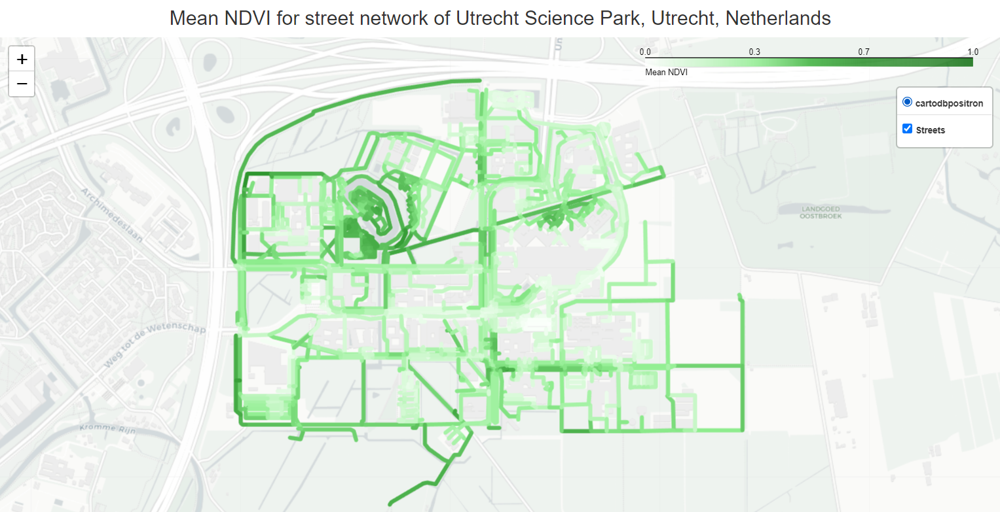
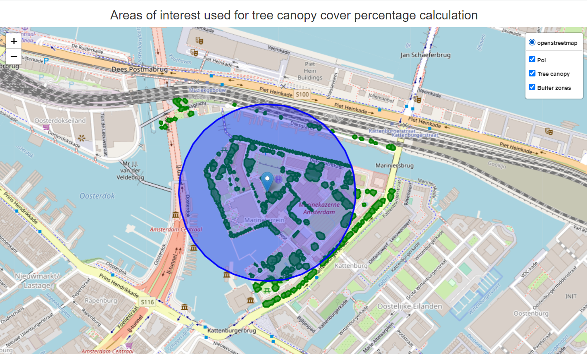
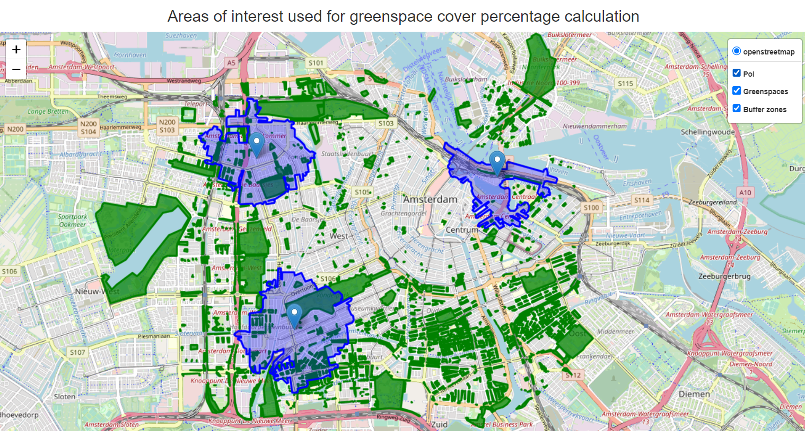
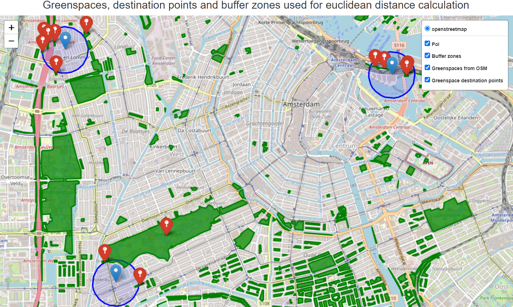
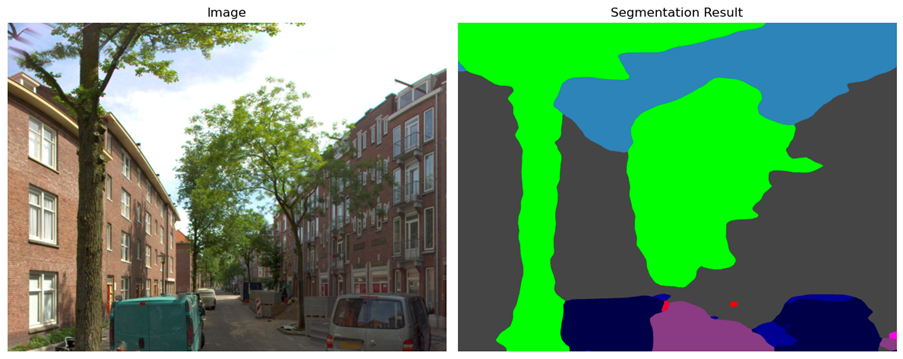
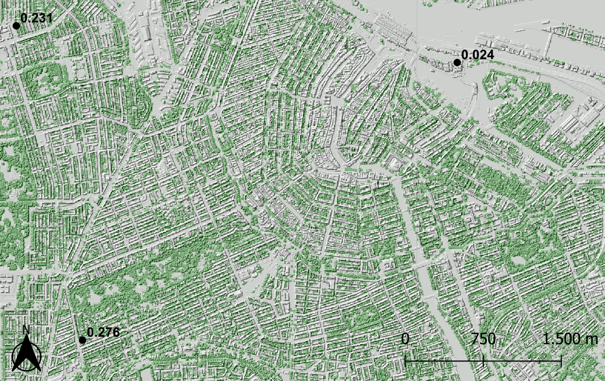

# GreenEx_Py: Greenness Exposure Assessment in Python 

# Aim and objectives
The aim of this package is to provide researchers with an open-source and user-friendly tool that may facilitate analyses concerning the ecological and societal effects of greenspace exposure, among others, in a robust and transparent way. 

# Table of Contents

- [Installation](#Installation)
- [Functionalities](#Functionalities)
    - [Availability](#Availability)
        - [Mean NDVI](#get_mean_NDVI)
        - [Percentages for land cover classes](#get_landcover_percentages)
        - [Percentage of canopy coverage](#get_canopy_percentage)
        - [Percentage of greenspace area coverage](#get_greenspace_percentage)
    - [Accessibility](#Accessibility)
        - [Shortest distance to greenspace](#get_shortest_distance_greenspace)
    - [Visibility](#Visibility)
        - [Streetview GVI](#get_streetview_GVI)
        - [Viewshed GVI](#get_viewshed_GVI)
- [Sources](#Sources)
- [Acknowledgements & Contact](#Acknowledgements-and-Contact-Information)

# Installation
To install the python module on your local computer, please refer to the instruction manuals for [Windows](https://github.com/Spatial-Data-Science-and-GEO-AI-Lab/GreenEx_Py/blob/main/Installation/Windows_install.md) and [Mac](https://github.com/Spatial-Data-Science-and-GEO-AI-Lab/GreenEx_Py/blob/main/Installation/Mac_install.md). Alternatively, you can use the module in Google Colab by running the notebook(s) in the [Colab](https://github.com/Spatial-Data-Science-and-GEO-AI-Lab/GreenEx_Py/tree/main/Colab) folder.

NOTE: Local issues may be encountered when running the module locally on a Mac device, as was the case during testing. The module is developed on a Windows device and a separate yml file, containing the python environment, had to be created for Mac. 

# Functionalities
This python module models greenspace exposure from three perspectives; availability, accessibility and visibility.

- Availability refers to the presence and quantity of greenspaces within a particular region.
- Accessibility in this case relates to the proximity of greenspaces. 
- Visibility refers to the extent to which greenspaces are visible from particular locations. 

The functions which were created to model the greenspace exposure as defined by these three perspectives will be further explained below by providing examples using the following data;

```python
import geopandas as gpd

# Path to data
path = "TestData/"
example_data = gpd.read_file(path + "AMS_example_data.gpkg")
```
The resulting geodataframe contains three locations in Amsterdam (The Netherlands), has a projected Coordinate Reference System (EPSG:28992) and looks as follows;

|   | geometry                      |
|--:|-------------------------------|
| 0 | POINT (118883.345 485054.641) |
| 1 | POINT (118246.855 488082.089) |
| 2 | POINT (122483.550 487728.517) |

Note that all example data files which are being used for the examples below, as well as additional test data, are available in the [TestData](https://github.com/Spatial-Data-Science-and-GEO-AI-Lab/GreenEx_Py/tree/main/TestData) folder.

For a more detailed overview of the function arguments, requirements and output, please look into the [documentation](https://github.com/Spatial-Data-Science-and-GEO-AI-Lab/GreenEx_Py/tree/main/Documentation) section of the module.

## *Availability*
Greenspace availability is measured using four functions; [get_mean_NDVI](#get_mean_NDVI), [get_landcover_percentages](#get_landcover_percentages), [get_canopy_percentage](#get_canopy_percentage) and [get_greenspace_percentage](#get_greenspace_percentage). 
<br><br>
All functions will return a geodataframe that contains points/polygons/places of interest (PoI), as provided/indicated by the user, and the resulting values of the function involved. PoIs may for example represent house addresses or neighbourhoods. The results' values are based on an area of interest (AoI) which can be composed in three distinct ways;

- AoI(s) provided by user (i.e. polygon geometries) and without applying a buffer zone
- AoI(s) created by defining Euclidean buffer
- AoI(s) created by defining Network buffer

To illustrate the differences between the latter two, the following figure was generated in which: 
1. The provided point location is shown in black
2. The euclidean buffer (500 meters) is shown in red
3. The network buffer (10-min walking distance) is shown in blue
4. The street network is shown in gray


The four availability functions are briefly described hereunder. 

### **get_mean_NDVI**
This function may calculate the mean Normalized Difference Vegetation Index (NDVI) within an area of interest that is defined for/by the PoIs provided by the user. In this case, the PoIs should be provided either in a vector file format or a geodataframe, ideally with a projected CRS.
Alternatively, users may provide an OpenStreetMap query (city, village, neighbourhood etc.) for which the street network will be extracted. The mean NDVI values will then be computed for each of these streets. 

Additionally, users may provide a raster file with NDVI values. If not provided, sentinel-2-l2a data from [Planetary Computer](https://planetarycomputer.microsoft.com/) will be used to compute the NDVI raster. The NDVI raster which was created for the three locations of the example data is included in the following figure;


Now, the mean NDVI for these designated areas can be calculated by applying the following code;

```python
availability.get_mean_NDVI(point_of_interest=path+"AMS_example_data.gpkg",
                           buffer_type="euclidean",
                           buffer_dist=300,
                           write_to_file=False,
                           save_ndvi=False)

# Information provided while function was running
Retrieving NDVI raster through planetary computer...
Information on the satellite image retrieved from planetary computer, used to calculate NDVI values:              
   Date on which image was generated: 2023-06-14T18:28:31.597880Z              
   Percentage of cloud cover: 0.084894              
   Percentage of pixels with missing data 3e-05
Done, running time: 0:00:13.447168 

Calculating mean NDVI values...
Done, running time: 0:00:01.881099 
```

Function output; 


|   | geometry                      | id | mean_NDVI | std_NDVI |
|---|-------------------------------|----|-----------|----------|
| 0 | POINT (118883.345 485054.641) | 1  | 0.204     | 0.136    |
| 1 | POINT (118246.855 488082.089) | 2  | 0.187     | 0.129    |
| 2 | POINT (122483.550 487728.517) | 3  | 0.047     | 0.073    |


In case an OpenStreetMap query is passed to the function, e.g. Utrecht Science Park, Utrecht, the Netherlands, the code and output will look as follows;

```python
availability.get_mean_NDVI(point_of_interest="Utrecht Science Park, Utrecht, Netherlands",
                           crs_epsg=28992,
                           buffer_dist=10,
                           write_to_file=False,
                           save_ndvi=False)

# Information provided while function was running
Retrieving street network through OpenStreetMap...
Done, running time: 0:00:07.976477 

Warning: The CRS of the PoI dataset is currently geographic, therefore it will now be projected to EPSG:28992 as specified
Retrieving NDVI raster through planetary computer...
Information on the satellite image retrieved from planetary computer, used to calculate NDVI values:              
   Date on which image was generated: 2023-06-14T18:28:34.470534Z              
   Percentage of cloud cover: 0.010272              
   Percentage of pixels with missing data: 1.3e-05
Done, running time: 0:00:02.399560 

Calculating mean NDVI values...
Done, running time: 0:03:17.288334 
```




|      | name     | highway      | access  | oneway | reversed      | length  | geometry                                          | maxspeed | width | bridge | service | lanes | tunnel | id   | mean_NDVI | std_NDVI |
|------|----------|--------------|---------|--------|---------------|---------|---------------------------------------------------|----------|-------|--------|---------|-------|--------|------|-----------|----------|
| 0    | Limalaan | unclassified | private | False  | True          | 102.988 | LINESTRING (140825.144 454765.636, 140928.453 ... | NaN      | NaN   | NaN    | NaN     | NaN   | NaN    | 1    | 0.536     | 0.076    |
| 1    | Limalaan | unclassified | private | False  | [False, True] | 86.599  | LINESTRING (140825.507 454852.284, 140825.459 ... | NaN      | NaN   | NaN    | NaN     | NaN   | NaN    | 2    | 0.401     | 0.086    |
| 2    | Limalaan | unclassified | private | False  | True          | 56.267  | LINESTRING (140928.453 454765.788, 140984.896 ... | NaN      | NaN   | NaN    | NaN     | NaN   | NaN    | 3    | 0.429     | 0.070    |
| ...  | ...      | ...          | ...     | ...    | ...           | ...     | ...                                               | ...      | ...   | ...    | ...     | ...   | ...    | ...  | ...       | ...      |
| 2239 | NaN      | service      | NaN     | False  | True          | 21.897  | LINESTRING (139701.620 455614.724, 139708.832 ... | NaN      | NaN   | NaN    | NaN     | NaN   | NaN    | 2240 | 0.421     | 0.107    |
| 2240 | NaN      | service      | NaN     | False  | False         | 26.681  | LINESTRING (139717.613 455660.636, 139708.832 ... | NaN      | NaN   | NaN    | NaN     | NaN   | NaN    | 2241 | 0.382     | 0.130    |
| 2241 | NaN      | footway      | NaN     | False  | False         | 40.705  | LINESTRING (140435.720 454723.291, 140465.012 ... | NaN      | NaN   | NaN    | NaN     | NaN   | NaN    | 2242 | 0.258     | 0.096    |


### **get_landcover_percentages**
This function calculates the percentage of area that is covered by each landcover class for an area of interest. Users should provide PoIs either in a geopackage vector file format or a geodataframe, ideally with a projected Coordinate Reference System (CRS).

Additionally, users may provide a raster file with landcover class values. If not provided, esa-worldcover data from [Planetary Computer](https://planetarycomputer.microsoft.com/) will be used to compute the landcover class raster. The landcover class raster which was created for the three locations of the example data is included in the following figure;

 
<br>where:

| 10         | 20        | 30        | 40       | 50       | 60                       | 70           | 80                     | 90                 | 95        | 100             |
|------------|-----------|-----------|----------|----------|--------------------------|--------------|------------------------|--------------------|-----------|-----------------|
| Tree cover | Shrubland | Grassland | Cropland | Built-up | Bare / sparse vegetation | Snow and ice | Permanent water bodies | Herbaceous wetland | Mangroves | Moss and lichen |

Now, the percentage of landcover class values for the designated areas can be calculated by applying the following code;

```python
availability.get_landcover_percentages(point_of_interest=path+"AMS_example_data.gpkg",
                                       buffer_dist=500,
                                       buffer_type="euclidean",
                                       save_lulc=False,
                                       write_to_file=False)

# Information provided while function was running
Retrieving landcover class raster through planetary computer...
Information on the land cover image retrieved from planetary computer:              
   Image description: ESA WorldCover product at 10m resolution              
   Image timeframe: 2021-01-01T00:00:00Z - 2021-12-31T23:59:59Z
Done, running time: 0:00:02.506165 

Calculating landcover class percentages...
Done, running time: 0:00:00.509130  
```

Function output;

|   | geometry                      | id | 0       | Tree cover | Grassland | Built-up | Bare / sparse vegetation | Permanent water bodies | Cropland |
|--:|-------------------------------|----|---------|------------|-----------|----------|--------------------------|------------------------|----------|
| 0 | POINT (118883.345 485054.641) | 1  | 21.843% | 21.37%     | 0.771%    | 53.247%  | 0.013%                   | 2.757%                 | NaN      |
| 1 | POINT (118246.855 488082.089) | 2  | 21.302% | 18.135%    | 1.687%    | 57.813%  | 0.114%                   | 0.928%                 | 0.021%   |
| 2 | POINT (122483.550 487728.517) | 3  | 21.357% | 2.091%     | 0.514%    | 40.361%  | 0.034%                   | 35.643%                | NaN      |


### **get_canopy_percentage**
This function calculates the percentage of area that is covered by tree canopy. Users should provide PoIs either in a vector file format or geodataframe, ideally with a projected Coordinate Reference System (CRS). Also, a tree canopy vector file should be provided which solely contains polygon or multipolygon geometries since areas cannot be calculated from point geometries.

The percentage of area that is covered by tree canopy can be calculated by applying the following code;

```python
availability.get_canopy_percentage(point_of_interest=path+"AMS_canopy_example.gpkg",
                                   canopy_vector_file=path+"AMS_canopy_segment.gpkg",
                                   buffer_type="euclidean",
                                   buffer_dist=250,
                                   write_to_file=False)

# Information provided while function was running
Adjusting CRS of Greenspace file to match with Point of Interest CRS...
Done 

Calculating percentage of tree canopy coverage...
Done, running time: 0:00:00.813638 
```

Note that different testdata was used for this example due to the limited availability of tree canopy data.
The data used looks as follows;

 

Function output;

|   | geometry                      | id | canopy_cover |
|---|-------------------------------|----|--------------|
| 0 | POINT (122906.402 487497.569) | 1  | 12.31%       |

### **get_greenspace_percentage**
This function calculates the percentage of area that is covered by greenspaces. Users should provide PoIs either in a vector file format or geodataframe, ideally with a projected Coordinate Reference System (CRS). 

Additionally, users may provide a vector file which contains greenspace geometries. These geometries should solely come in polygon/multipolygon format since areas cannot be calculated from point geometries. If the file is not provided, greenspaces will be extracted from [OpenStreetMap](https://osmnx.readthedocs.io/en/stable/). Suitable Urban Greenspaces meet the following requirements, as indicated by [Bart Breekveldt](https://github.com/Spatial-Data-Science-and-GEO-AI-Lab/Urban_Greenspace_Accessibility):
1. Tags represent an area
2. The area is outdoor
3. The area is (semi-)publically available
4. The area is likely to contain trees, grass and/or greenery
5. The area can reasonable be used for walking or recreational activities

The following figure illustrates the greenspaces that have been extracted through OpenStreetMap (green), including the three point locations of the example_data and a 15-min walking distance network buffer for each (blue);



The percentage of area that is covered by greenspaces can be calculated by applying the following code;

```python
availability.get_greenspace_percentage(point_of_interest=path+"AMS_example_data.gpkg",
                                       buffer_type="network",
                                       travel_speed=5,
                                       trip_time=15,
                                       network_type="walk",
                                       write_to_file=False)

# Information provided while function was running
Retrieving greenspaces within total bounds of Point(s) of interest, extended by buffer distance if specified...
Done, running time: 0:00:09.669733 

Retrieving network within total bounds of Point(s) of interest, extended by buffer distance as specified...
Done, running time: 0:00:44.845513 

Retrieving isochrone for point(s) of interest: 100%
3/3 [00:17<00:00, 5.31s/it]
Note: creation of isochrones based on code by gboeing, source: https://github.com/gboeing/osmnx-examples/blob/main/notebooks/13-isolines-isochrones.ipynb 

Calculating percentage of greenspace area coverage...
Done, running time: 0:00:00.597858 
```

Function output;

|   | geometry                      | id | greenspace_cover |
|---|-------------------------------|----|------------------|
| 0 | POINT (118883.345 485054.641) | 1  | 16.84%           |
| 1 | POINT (118246.855 488082.089) | 2  | 11.73%           |
| 2 | POINT (122483.550 487728.517) | 3  | 1.14%            |

## *Accessibility*
Greenspace accessibility is currently measured using one function; [get_shortest_distance_greenspace](#get_shortest_distance_greenspace). 
<br><br>
The function will return a geodataframe that contains the original points/polygons of interest (PoI), as provided by the user, and the resulting values of the function involved.

### **get_shortest_distance_greenspace**
This function returns information on the presence of greenspaces within a certain threshold distance of address locations. Users should provide PoIs either in a vector file format or geodataframe, ideally with a projected Coordinate Reference System (CRS).

Additionally, users should define the following;
1. The threshold (target) distance to consider (meters)
2. Distance type, i.e. the way in which to consider the target distance; euclidean or network
3. The greenspaces' destination points; entrance or centroids. If set to entrance, pseudo greenspace entry points will be created by computing a buffer of 20m around the greenspace polygons and intersecting this buffer zone with the road network. The points of intersection will then serve as pseudo entry points. NOTE: this requires the network to be extracted, even if distance type is set to euclidean. If set to centroids, the distance to the greenspace's center point will be calculated.

The greenspaces will again be extracted through [OpenStreetMap](https://osmnx.readthedocs.io/en/stable/) using the same requirements as mentioned before and indicated by [Bart Breekveldt](https://github.com/Spatial-Data-Science-and-GEO-AI-Lab/Urban_Greenspace_Accessibility).

Consider the point locations as given in the example data and the following scenario parameters; <br>
- Target distance: 300m
- Distance type: Euclidean
- Destination: Centroids
- Minimum greenspace area: 400m<sup>2</sup>

The function can be applied as follows;
```python
accessibility.get_shortest_distance_greenspace(point_of_interest=path+"AMS_example_data.gpkg",
                                               target_dist=300,
                                               distance_type='euclidean',
                                               destination='centroids',
                                               min_greenspace_area=400,
                                               write_to_file=False)

# Information provided while function was running
Retrieving greenspaces within total bounds of point(s) of interest, extended by a 450.0m buffer to account for edge effects...
Done, running time: 0:00:08.386876 

Calculating shortest distances...
Warning: no greenspace centroids could be detected within euclidean distance of 300m for PoI with id 1, distance_to_greenspace is therefore set to target distance. Consider for further analysis.
Done, running time: 0:00:00.162571 
```

In the figure below, the PoIs and their buffer zones are plotted in blue, the greenspace centroids (destination points) in red and the greenspaces in green. Note that only destination points are created for greenspaces that intersect the PoI buffer zones;



Function output;

|   | geometry                      | id | greenspace_within_300m | distance_to_greenspace |
|---|-------------------------------|----|------------------------|------------------------|
| 0 | POINT (118883.345 485054.641) | 1  | False                  | 300.0                  |
| 1 | POINT (118246.855 488082.089) | 2  | True                   | 177.0                  |
| 2 | POINT (122483.550 487728.517) | 3  | True                   | 135.0                  |

The function returns a boolean value indicating whether at least one greenspace is within the target distance. Additionally, it provides the distance in meters. Note that if no greenspace is found within the threshold distance, the distance_to_greenspace is set to the threshold's value. 

## *Visibility*
Greenspace visibility is measured using two functions; [get_streetview_GVI](#get_streetview_GVI) and [get_viewshed_GVI](#get_viewshed_GVI). 
<br><br>
The functions will return a geodataframe that contains the original points/polygons of interest (PoI), as provided by the user, and the resulting values of the function involved.

Examples will be provided below for both functions. Note that the streetview GVI function was based on research conducted by [Ilse A. Vázquez Sánchez](https://github.com/Spatial-Data-Science-and-GEO-AI-Lab/StreetView-NatureVisibility) whereas the viewshed GVI function was based on research conducted by [Labib et al., (2021)](https://github.com/jonnyhuck/green-visibility-index/tree/master). 

### **get_streetview_GVI**
This function calculates the average Greenness Visibility Index for an area of interest based on streetview images which are retrieved through the [Mapillary API](https://www.mapillary.com/?locale=en_US). Users should provide PoIs either in a vector file format or geodataframe, ideally with a projected Coordinate Reference System (CRS).

The function generates sample road locations surrounding points of interest or within a polygon of interest (based on user inputs). For these sample road locations, streetview images are retrieved if these are available within a 100 meter distance. Using a segmentation algorithm, the amount of visible greenness is determined and the index is calculated. The GVI scores for the sample road locations will be averaged to end up with a mean GVI score for each of the original PoIs as provided by the user. 

The function get_streetview_GVI() does not save the Mapillary images used for analysis. To visualize part of the function's process however, the following figures were generated by [Ilse A. Vázquez Sánchez](https://github.com/Spatial-Data-Science-and-GEO-AI-Lab/StreetView-NatureVisibility).

**Panoramic image, GVI: 0.801**


In case the selected Mapillary image is panoramic, the road centers are identified and based on these, the original image is split into two for further analysis. 

**Non-panoramic image, GVI: 0.325**



To apply the streetview GVI function using the example data and a buffer of 150 meters surrounding each point location, the following code can be used;

```python
visibility.get_streetview_GVI(point_of_interest=path+"AMS_example_data.gpkg",
                              access_token="MAPILLARY_API_TOKEN",
                              buffer_dist=150,
                              write_to_file=False)

# Information provided while the function was running
Retrieving network within total bounds of Point(s) of interest, extended by the buffer_dist in the case provided...
Done, running time: 0:00:47.329337 

Computing sample points for roads within the area of interest's network...
Done, running time: 0:00:01.145286 

Downloading StreetView images for road sample points...
Downloading tiles: 100%
5/5 [00:20<00:00, 3.44s/it]
Downloading images: 100%
86/86 [43:10<00:00, 23.47s/it]
Done, running time: 0:44:08.827193 

Calculating StreetView GVI score...
Done, running time: 0:00:00.373096 

Note: workflow for calculating Streetview GVI based on code by Ilse A. Vázquez Sánchez 
source: https://github.com/Spatial-Data-Science-and-GEO-AI-Lab/StreetView-NatureVisibility 
``` 

Function output (pt.1);

|   | id | geometry                      | GVI      | nr_of_points |
|---|----|-------------------------------|----------|--------------|
| 0 | 1  | POINT (118883.345 485054.641) | 0.153368 | 33           |
| 1 | 2  | POINT (118246.855 488082.089) | 0.212064 | 36           |
| 2 | 3  | POINT (122483.550 487728.517) | 0.003300 | 13           |


Function output (pt.2);

|     | id  | geometry                      | GVI      | is_panoramic | missing |
|-----|-----|-------------------------------|----------|--------------|---------|
| 0   | 1   | POINT (119009.625 484981.604) | 0.077009 | True         | False   |
| 1   | 1   | POINT (118963.280 484962.840) | 0.070314 | True         | False   |
| 2   | 1   | POINT (118916.934 484944.076) | 0.102058 | True         | False   |
| 3   | 1   | POINT (118870.022 484927.224) | 0.064482 | True         | False   |
| 4   | 1   | POINT (118855.540 484975.007) | 0.014510 | True         | False   |
| ... | ... | ...                           | ...      | ...          | ...     |
| 81  | 3   | POINT (122504.938 487845.950) | 0.000000 | True         | False   |
| 82  | 3   | POINT (122344.012 487735.541) | NaN      | None         | True    |
| 83  | 3   | POINT (122393.881 487732.156) | 0.000000 | True         | False   |
| 84  | 3   | POINT (122408.407 487615.927) | 0.001916 | False        | False   |
| 85  | 3   | POINT (122353.549 487686.836) | NaN      | None         | True    |

The function returns the average GVI value as well as the number of sample road locations upon which this value was based. It should be noted that the function highly depends on the availability of streetview images. The second dataframe that is returned by the function includes each sample road location that was computed and its corresponding image's information. If missing is equal to True, no image could be found within 100 meters of the sample road location. The ID column can be used to match the sample road locations with the original PoI as provided by the user. 

### **get_viewshed_GVI**
This function calculates the average Greenness Visibility Index for an area of interest based on a viewshed analysis. Users should provide PoIs either in a vector file format or geodataframe, ideally with a projected Coordinate Reference System (CRS). Also, they should provide three raster files containing the Digital Surface Model (DSM), Digital Terrain Model (DTM) and binary greenspace values, respectively. To clarify, the greenspace raster should contain 0 values for pixels that are not considered green and 1 value for pixels that are considered green. Example data for a DSM and DTM can be retrieved from this [site](https://zenodo.org/record/5061257).

The function generates sample road locations surrounding points of interest or within a polygon of interest (based on user inputs). It then processes the DSM and DTM to create a viewshed for each of the sample road locations. The viewshed is used to determine the number of visible green pixels as well as the total number of pixels that is visible from each sample road location so that a ratio can be calculated. These GVI scores for the sample road locations will be averaged to end up with a mean GVI score for each of the original PoIs as provided by the user.

Consider the point locations as given in the example data and the following scenario parameters that should be specified by the user; <br>
- Buffer distance: 100 meters (threshold distance from the PoI for which sample road locations should be computed)
- Viewing distance: 250 meters (the viewing distance range to consider)
- Sample distance: 50 meters (the distance interval to consider when computing sample road locations)
- observer height: 1.7 meters (the height of an individual person, needed to determine what is visible and what is not)

The viewshed GVI function can be applied as follows;

```python
visibility.get_viewshed_GVI(point_of_interest=path+"AMS_example_data.gpkg",
                            greendata_raster_file=path+"AMS_trees_binary_crs.tif",
                            dtm_raster_file=path+"AMS_DTM_crs.tif",
                            dsm_raster_file=path+"AMS_DSM_crs.tif",
                            buffer_dist=100,
                            viewing_dist=250,
                            sample_dist=50,
                            observer_height=1.7,
                            write_to_file=False)

# Information provided while function was running
Retrieving network within total bounds of Point(s) of interest, extended by the buffer_dist in case provided...
Done, running time: 0:00:28.402266 

Computing sample points for roads within area of interest's network...
Note: creation of sample points based on code by Ondrej Mlynarcik 
source: https://github.com/Spatial-Data-Science-and-GEO-AI-Lab/2.5D-GreenViewIndex-Netherlands/blob/main/sample_points_linestrings.ipynb
Done, running time: 0:00:00.160945 

Calculating GVI for Point 1: 100%
117/117 [00:15<00:00, 7.82it/s]
Calculating GVI for Point 2: 100%
86/86 [00:11<00:00, 8.53it/s]
Calculating GVI for Point 3: 100%
48/48 [00:06<00:00, 7.09it/s]
Note: calculation of Viewshed GVI based on code by Johnny Huck and Labib Labib 
source: https://github.com/jonnyhuck/green-visibility-index/blob/master/gvi.py 
```

The resulting GVI values for the example data locations are shown in the figure below where an overlay is included of the DSM and the binary trees raster.



Function output (pt.1);

|   | geometry                      | id | GVI   | nr_of_points |
|---|-------------------------------|----|-------|--------------|
| 0 | POINT (118883.345 485054.641) | 1  | 0.276 | 117          |
| 1 | POINT (118246.855 488082.089) | 2  | 0.231 | 86           |
| 2 | POINT (122483.550 487728.517) | 3  | 0.024 | 48           |

Function output (pt.2);

|     | id  | geometry                      | GVI      |
|-----|-----|-------------------------------|----------|
| 0   | 1   | POINT (118602.894 485014.928) | 0.157408 |
| 1   | 1   | POINT (118656.183 485033.863) | 0.185535 |
| 2   | 1   | POINT (118708.299 485057.627) | 0.159684 |
| 3   | 1   | POINT (118760.416 485081.391) | 0.184989 |
| 4   | 1   | POINT (118813.406 485102.752) | 0.222209 |
| ... | ... | ...                           | ...      |
| 246 | 3   | POINT (122454.133 487733.398) | 0.0      |
| 247 | 3   | POINT (122451.895 487596.911) | 0.0      |
| 248 | 3   | POINT (122446.453 487664.938) | 0.0      |
| 249 | 3   | POINT (122441.012 487732.964) | 0.007802 |
| 250 | 3   | POINT (122467.668 487726.301) | 0.0      |

The function returns the average GVI value as well as the number of sample road locations upon which this value was based. To get a better idea of how the average GVI values were calculated, an additional dataframe is returned by the function. This dataframe contains all the sample road locations and their corresponding GVI values. The ID column can be used to match the sample road locations with the original PoI as provided by the user. 


## Sources
- Retrieving road network: [OpenStreetMap](https://osmnx.readthedocs.io/en/stable/)
- Retrieving satellite images for NDVI and landcover calculations: [Planetary Computer](https://planetarycomputer.microsoft.com/)
- Calculating GVI based on viewshed analysis: [Labib et al., (2021)](https://github.com/jonnyhuck/green-visibility-index/tree/master)
- Calculating GVI based on streetview images: [Ilse A. Vázquez Sánchez](https://github.com/Spatial-Data-Science-and-GEO-AI-Lab/StreetView-NatureVisibility)
- Retrieving images for Streetview GVI: [Mapillary](https://www.mapillary.com/?locale=en_US)
- Computing sample road locations from the network: [Ondrej Mlynarcik](https://github.com/Spatial-Data-Science-and-GEO-AI-Lab/2.5D-GreenViewIndex-Netherlands/blob/main/sample_points_linestrings.ipynb)
- Creation of network buffer isochrones: [Geoff Boeing](https://github.com/gboeing/osmnx-examples/blob/main/notebooks/13-isolines-isochrones.ipynb)
- Suitable Urban Greenspaces to represent greenspace areas: [Bart Breekveldt](https://github.com/Spatial-Data-Science-and-GEO-AI-Lab/Urban_Greenspace_Accessibility)

## Acknowledgements and Contact Information
Project made in collaboration with Dr. SM Labib from the Department of Human Geography and Spatial Planning at Utrecht University. This is a project of the Spatial Data Science and Geo-AI Lab, conducted for the Applied Data Science MSc degree by [Yúri Grings](https://github.com/YuriGrings).

Contact Information:

| Name        | Email                       |
|-------------|-----------------------------|
| Yúri Grings | y.n.f.grings@students.uu.nl |
| S.M. Labib  | s.m.labib@uu.nl             |
